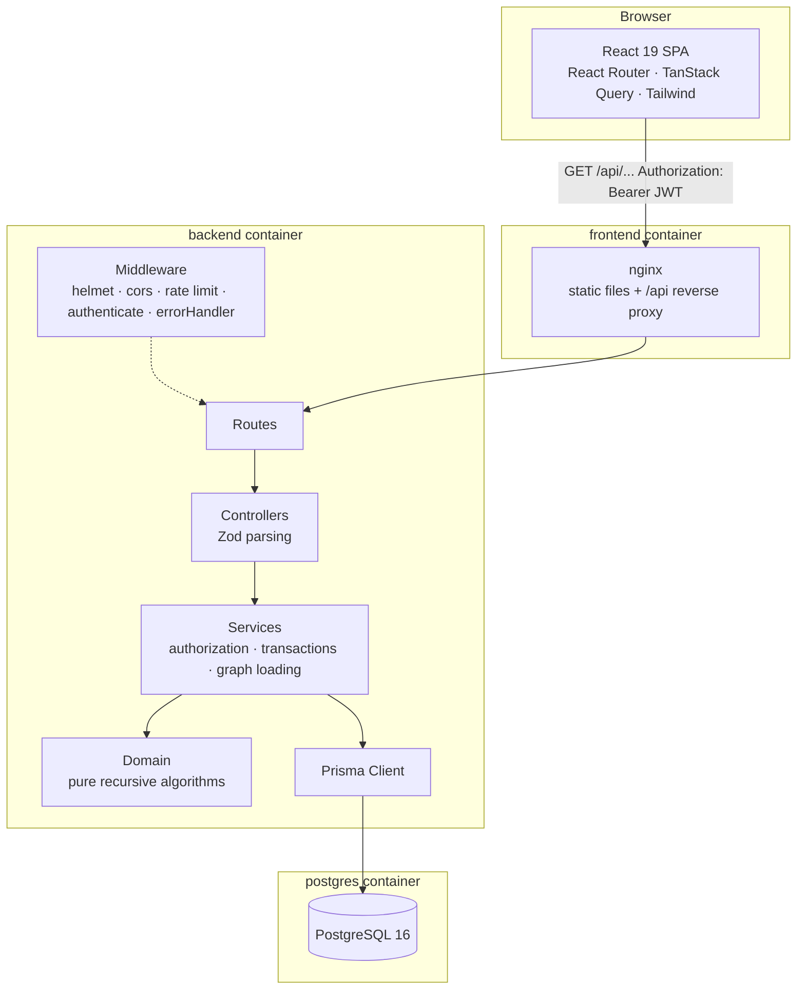
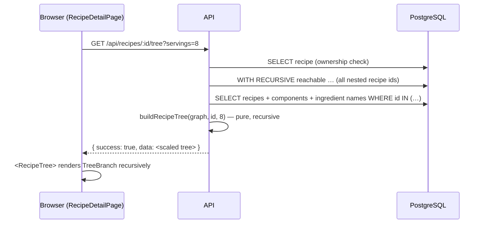
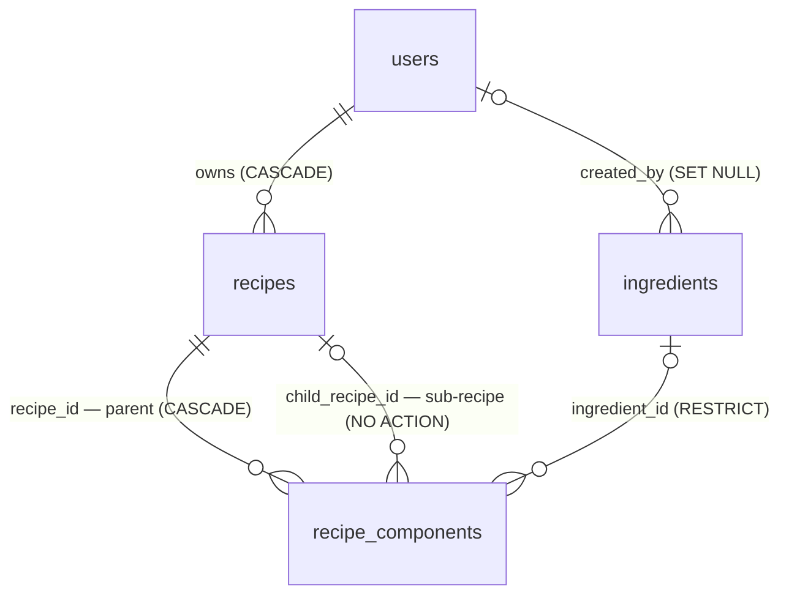
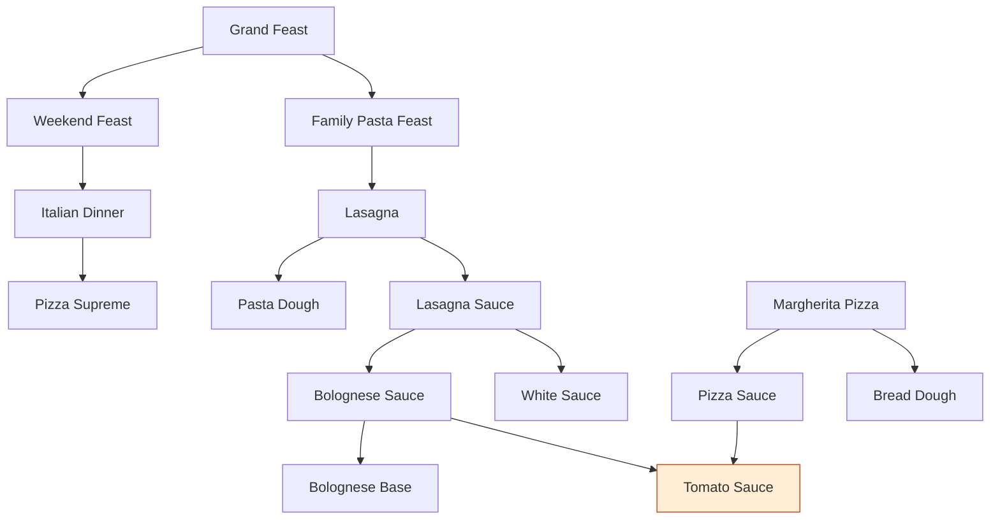
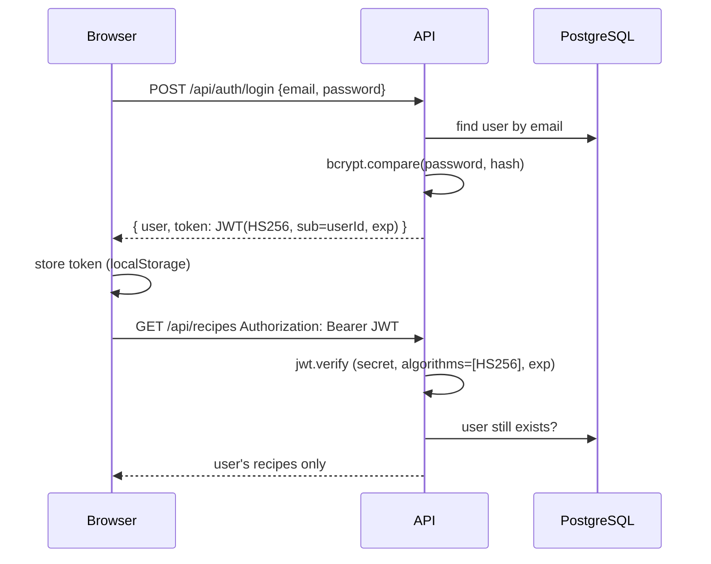
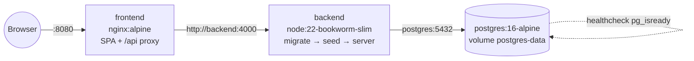

# Architecture

This document explains how the Recipe Composition & Management System is built and why. For setup
and the API reference see [README.md](README.md).

## 1. Overall architecture



Layering (backend, `backend/src`):

| Layer | Responsibility | Knows about HTTP? | Knows about DB? |
|---|---|---|---|
| `routes/` | URL → controller, which routes need `authenticate` | yes | no |
| `controllers/` | parse params/query/body with Zod, call a service, wrap the result in `{ success, data }` | yes | no |
| `services/` | ownership checks, validation of references, cycle checks, transactions, loading graphs | no | yes |
| `domain/` | **pure** functions: recipe tree, ingredient totals, scaling, cycle detection, units | no | no |
| `middleware/` | JWT authentication, error → HTTP mapping | yes | minimal |

The domain layer has no I/O, so the most important logic — recursion, scaling, cycle detection —
is tested in isolation (52 unit tests) and reused by the API, the dataset importer and the shopping list.

## 2. Frontend ↔ backend communication

- JSON over HTTP. Every response uses one envelope: `{ success: true, data, meta? }` or
  `{ success: false, message, errors? }`.
- `frontend/src/api/client.ts` attaches `Authorization: Bearer <jwt>`, unwraps the envelope and
  throws a typed `ApiError(status, message, details)`. A 401 on an authenticated request logs the
  user out globally.
- TanStack Query caches server state. Query keys are hierarchical (`['recipes', 'tree', id, servings]`),
  and because recipes embed each other, any recipe mutation invalidates every `['recipes', …]` query.
- In Docker, nginx serves the SPA and proxies `/api` to `backend:4000`, so the browser sees a single
  origin. In development, Vite proxies `/api` to `localhost:4000`. For split hosting the frontend
  is built with `VITE_API_URL` and the backend allows that origin via `FRONTEND_URL` (CORS).



## 3. Database schema



| Table | Key columns | Constraints / indexes |
|---|---|---|
| `users` | `id uuid`, `email`, `name`, `password_hash` | unique `email` |
| `ingredients` | `id`, `name`, `description`, `default_unit`, `external_id`, `created_by_id` | unique `lower(name)`, unique `external_id`, non-blank name |
| `recipes` | `id`, `user_id`, `name`, `description`, `category`, `servings`, `external_id` | unique `(user_id, lower(name))`, unique `(user_id, external_id)`, `servings > 0`, index `(user_id, updated_at)` |
| `recipe_components` | `id`, `recipe_id`, `ingredient_id?`, `child_recipe_id?`, `quantity`, `unit`, `position` | `num_nonnulls(ingredient_id, child_recipe_id) = 1`, `child_recipe_id <> recipe_id`, `quantity > 0`, `position >= 0`, recipe lines have unit `batch`/`serving`; indexes `(recipe_id, position)`, `ingredient_id`, `child_recipe_id` |

Prisma cannot express CHECK constraints or functional indexes, so they are appended by hand to the
initial migration (`prisma/migrations/20261008000000_init/migration.sql`); `prisma migrate dev`
reports no drift with them in place.

### Modelling the polymorphic component

| Option | Verdict |
|---|---|
| `target_type` + `target_id` (no FK) | ✗ no referential integrity, orphans possible |
| Separate `recipe_ingredients` and `recipe_subrecipes` tables | ✓ integrity, ✗ ordering a single component list across two tables is awkward |
| **One table, two nullable FKs + CHECK "exactly one"** | ✓ real FKs, ✓ one ordered list, ✓ DB-enforced XOR — **chosen** |

### Deletion semantics

| Action | Behaviour | Enforced by |
|---|---|---|
| Delete recipe used by another recipe | **409**, lists the parents | service check + FK `NO ACTION` |
| Delete recipe | its own component lines are deleted; sub-recipes untouched | FK `CASCADE` on `recipe_id` |
| Delete ingredient used anywhere | **409** with usage count | service check + FK `RESTRICT` |
| Delete user | all of their recipes are deleted | FK `CASCADE`; `NO ACTION` (checked at statement end) lets the cascade remove parents and children together |

## 4. Recursive recipe model

- A recipe yields `servings` servings per **batch**; component quantities are per batch.
- A component is either an ingredient line (`quantity unit`) or a sub-recipe line
  (`quantity batch` or `quantity serving`).
- Recipes form a **directed acyclic graph**. Reuse is by reference: Pizza Sauce *points to*
  Tomato Sauce; editing Tomato Sauce changes every recipe that uses it.


*(excerpt of the provided dataset; the shaded Tomato Sauce is reused by both Bolognese Sauce and Pizza Sauce)*

### Scaling (`domain/scaling.ts`)

```
rootFactor            = targetServings / recipe.servings          (1 when not scaling)
ingredient required   = line.quantity × factor
child factor (batch)  = factor × line.quantity
child factor (serving)= factor × line.quantity / child.servings
```

## 5. Recursive traversal

### Loading the graph — no N+1 (`services/recipeGraph.service.ts`)

```sql
WITH RECURSIVE reachable(id) AS (
  SELECT unnest($rootIds::uuid[])
  UNION                                   -- de-duplicates → terminates even on cyclic data
  SELECT rc.child_recipe_id FROM recipe_components rc
  JOIN reachable r ON rc.recipe_id = r.id
  WHERE rc.child_recipe_id IS NOT NULL
)
SELECT id FROM reachable;
```

followed by one `findMany({ where: { id: { in: ids } }, include components + ingredient names })`.
**Two queries for any depth**; a test asserts exactly one raw query and one `findMany` for a
16-level chain. Each recipe is loaded once, no matter how often it is reused.

### Building the tree (`domain/recipeTree.ts`)

```
buildRecipeNode(recipe, factor, depth):
  guard depth ≤ MAX_RECIPE_DEPTH, node count ≤ MAX_TREE_NODES
  if recipe ∈ path: return node{circular: true}            ← defensive, never recurse forever
  path.add(recipe)
  for component in recipe.components (by position):
     ingredient → leaf with quantity × factor
     recipe     → buildRecipeNode(child, childFactor(...), depth + 1)
  path.delete(recipe)
```

The guard uses the **current recursion path**, not a global visited set: Tomato Sauce may
appear in two branches of Lasagna's tree, and both must be shown. Every node gets a unique `key`
(the chain of component ids from the root), which the UI uses for expansion state.

### Rendering the tree (`frontend/src/features/recipes/RecipeTree.tsx`)

`RecipeTree` owns a `Set` of expanded keys (default: first two levels; *Expand all* / *Collapse all*
replace the set). `TreeBranch` renders one node and, if it is an expanded recipe, maps its children
to `TreeBranch` again — recursion mirrors the data. Accessibility: nested `<ul>` lists, disclosure
buttons with `aria-expanded`/`aria-controls`, ←/→ keys to collapse/expand, labelled "Open recipe"
links for navigation, colour + icon + text badge to distinguish **Recipe** from **Ingredient**.
Very deep trees scroll horizontally inside their card instead of breaking the page.

## 6. Ingredient expansion algorithm (`domain/ingredientTotals.ts`)

```
totalsPerBatch(recipe):                       # memoised
  if memo[recipe]: return memo[recipe]
  if recipe ∈ onPath: throw CircularDependency
  onPath.add(recipe)
  vector = {}
  for component in recipe.components:
     ingredient → vector[(ingredient, baseUnit)] += toBase(quantity, unit)
     recipe     → vector += totalsPerBatch(child) × childFactor(1, component)
  onPath.delete(recipe); memo[recipe] = vector
  return vector

totals(root, servings) = totalsPerBatch(root) × rootFactor(servings)
```

- **O(V + E)** thanks to memoisation (a naïve tree walk is exponential for heavily shared
  sub-recipes; a unit test expands a 40-level DAG with 2⁴⁰ root-to-leaf paths instantly).
- Units are normalised per dimension (g, ml) before summing; count units are kept separate.
- The shopping list shares one memo across several roots.

## 7. Cycle detection (`domain/cycleDetection.ts` + `services/componentTargets.service.ts`)

Adding parent → child is invalid iff `child = parent` or `parent` is reachable from `child`.

```
detectCycleOnAdd(graph, parent, child):
  if parent == child: return [parent, parent]
  path = findPath(graph, from=child, to=parent)   # iterative DFS, global visited set
  return path ? [parent, ...path] : null
```

- **Iterative** DFS (explicit stack) — no call-stack limit for very deep chains; **global visited
  set** — each recipe is expanded once, O(V+E), and terminates on corrupted data.
- Only edges *out of the parent* are added in one request, and a simple cycle passes the parent
  once, so checking each new child against the current graph is sufficient when a whole component
  list is replaced.
- **Race condition**: two concurrent requests (A→B, B→A) could each pass the check. All graph
  mutations of a user run in a transaction that first takes
  `pg_advisory_xact_lock(hashtext(userId))`, so they are serialised; an integration test fires
  both requests in parallel and expects exactly one 201 and one 409.
- **Depth limit on write**: the same check computes `longest chain above parent + 1 + longest chain
  below child` (memoised, `domain/dependencyDepth.ts`) and rejects edges that would nest recipes more
  than 100 levels deep (422), so every stored recipe stays expandable.
- Graph-mutating transactions use `withUserGraphLock` with explicit `maxWait`/`timeout` so large
  component lists and lock waits do not hit Prisma's 5 s default; a timeout is reported as 503.
- `findAnyCycle` (three-colour DFS distinguishing *on current path* from *finished*) validates whole
  datasets before import.
- The UI asks `GET /recipes/:id/usages` for the transitive users of the recipe being edited and
  disables those options in the sub-recipe picker; the server check remains authoritative.

## 8. Authentication



- Passwords: bcrypt (cost from `BCRYPT_SALT_ROUNDS`, default 12), 8–72 characters.
- JWT secret from the environment, validated (≥ 32 chars) at start-up; algorithm pinned to HS256
  to prevent algorithm-confusion attacks.
- Login and register are rate-limited per IP.
- **Token storage trade-off**: localStorage + Bearer header is simple and immune to CSRF (no
  cookies), but readable by injected scripts. Mitigations: React output escaping, no
  `dangerouslySetInnerHTML`, no third-party scripts, Helmet headers. An httpOnly-cookie session
  would be the next step for a production system.

## 9. Authorization

- Every recipe read/write goes through `getOwnedRecipe(userId, recipeId)`: missing → 404,
  someone else's → 403.
- Lists are always filtered by `userId`; the shopping list verifies ownership of every recipe.
- Sub-recipes must belong to the same user (otherwise user B could block user A from deleting a
  recipe, or read it through a tree).
- Ingredients are a shared catalogue: anyone signed in may read and add; only the creator may
  edit/delete, and renaming is refused while other users' recipes use it; dataset ingredients
  (no creator) are read-only.

## 10. Error handling & security

- `middleware/errorHandler.ts` maps `AppError` (explicit status), `ZodError` → 400 with field
  paths, Prisma `P2002` → 409, `P2003` → 409, `P2025` → 404, body-parser errors (malformed JSON
  400, payload too large 413), graph-limit errors → 422, transaction timeouts (`P2028`) → 503, everything else → 500 with a generic
  message. Stack traces are included only outside production; 5xx errors are logged to stderr.
- Helmet security headers, CORS restricted to `FRONTEND_URL`, JSON body limit 100 kB, `x-powered-by`
  disabled, Prisma parameterised queries (including the tagged-template recursive CTE), Zod
  validation of every params/query/body, env validation at start-up, no secrets in the repository.

## 11. Docker architecture



- **postgres** — health-checked with `pg_isready`; data in a named volume.
- **backend** — multi-stage build (deps → `prisma generate` → `tsc` → prune dev deps); runs as the
  non-root `node` user. `docker-entrypoint.sh` runs `prisma migrate deploy`, optionally the
  seed (`RUN_SEED=true`; imports the dataset only once, and a seed failure never blocks start-up), then the server. Starts only after postgres is healthy;
  health check on `/api/health` (which also pings the DB). Its port is **not published** on the
  host: Express trusts exactly one proxy hop (`trust proxy 1` = nginx) for client IPs, so a
  directly reachable API would let clients spoof `X-Forwarded-For` and evade the login rate limit.
- **frontend** — Vite build in a Node stage, served by nginx with SPA fallback, long-term caching
  of fingerprinted assets and a reverse proxy for `/api`; starts after the backend is healthy.
- Secrets (`JWT_SECRET`, `POSTGRES_PASSWORD`) are required from `.env` — compose refuses to start
  without them rather than falling back to hard-coded values.

## 12. Important design decisions & trade-offs

| Decision | Benefit | Trade-off |
|---|---|---|
| Server returns the whole expanded tree | one request, no per-node fetching, scaling done once | very large trees are capped (10 000 nodes / depth 100) |
| Recursive CTE + single `findMany` | constant query count for any depth | raw SQL fragment (parameterised) next to Prisma |
| Pure domain module | exhaustive, fast unit tests; reused everywhere | graph must be loaded before computing |
| Memoised totals | O(V+E) even with heavy reuse | memo is per request (no cross-request cache needed at this scale) |
| Prevent deleting referenced recipes | no silent changes to other recipes | user must detach first (UI shows where it is used) |
| Per-user advisory lock | closes concurrent-cycle race cheaply | serialises graph writes of a single user |
| Shared ingredient catalogue | no duplicate "Tomato" rows, matches dataset | ingredient edits are creator-only |
| `double precision` quantities | simple, sufficient for cooking | rounding to 3 decimals in responses |
| Unit conversion only within mass/volume | correct aggregation for common cases | no density-based g↔ml conversion |
| JWT in localStorage | simple, stateless, no CSRF | XSS exposure (mitigated; see §8) |
| 403 for other users' recipes | explicit authorization semantics | reveals existence of a random UUID (acceptable) |
