# Recipe Composer — Recipe Composition & Management System

**Inter IIT Tech Meet 15.0 — Developers Selection Task**

| | |
|---|---|
| **Name** | Kinshuk Harsoura |
| **Roll No.** | `<ROLL NUMBER — 25CH10067>` |

## Overview

Recipe Composer is a full-stack web app for creating, managing and exploring recipes whose
components can be **raw ingredients _or other recipes_**. A "Tomato Sauce" is defined once and then
*referenced* from "Pizza Sauce", "Bolognese Sauce", "Lasagna", … — never copied. Nesting depth is
unbounded; the backend expands recipes recursively (with scaling by servings), prevents circular
dependencies, and the frontend renders the composition as a recursive, collapsible tree.

The project ships with the **dataset provided with the task** (`ingredients.json`, `recipes.json`:
71 ingredients, 55 recipes, up to 6 levels of nesting), imported by the seed script.

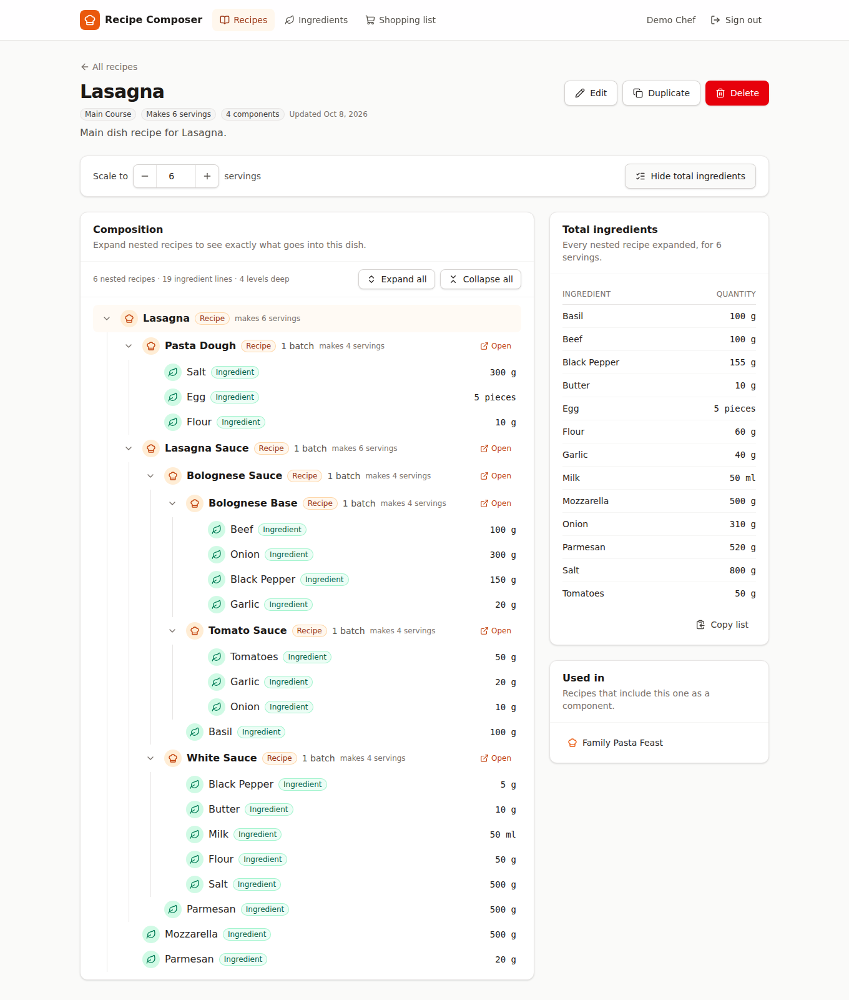

## Features

**Core**

- Email/password **authentication** (bcrypt + JWT); every recipe endpoint is protected and users can
  only see and modify **their own recipes**.
- **Full recipe management**: create, edit, delete recipes; add/remove/edit/reorder components;
  specify serving sizes; add ingredients and **existing recipes** as components.
- **Recipe reuse without duplication** — a recipe component is a foreign key to another recipe.
- **Recursive Recipe Explorer** — expand/collapse any node, Expand all / Collapse all, clear
  ingredient-vs-recipe distinction (icons, colours, badges), quantities and units, links to navigate
  into any nested recipe, keyboard support, horizontally scrollable for very deep trees.
- **Arbitrary nesting** in data, API and UI — no hard-coded levels (tested with 60+ levels).
- **Total ingredient expansion** ("View total ingredients") — recursively flattens every nested
  recipe, propagates quantities, converts compatible units (kg→g, l→ml, tbsp→ml…) and aggregates.
- **Serving-size scaling** — view any recipe for N servings; sub-recipes can be used as
  "× batch" (2 × Recipe B) or as "servings" (8 servings of a 4-serving sauce = 2 batches).
- **Circular dependency prevention** — A→A, A→B→A, A→B→C→A … rejected at any depth with a
  meaningful message (`Adding this recipe would create a circular dependency: B → A → B`); the editor
  also greys out recipes that would create a cycle.
- **Referential integrity** — a recipe or ingredient that is still used cannot be deleted (409 with
  the list of users); DB-level CHECK constraints guarantee each component targets exactly one thing.
- Validation (Zod) on every input, consistent JSON responses, centralized error handling.
- Polished, responsive UI: loading / empty / error states, confirmation dialogs, toasts.
- Docker Compose setup (PostgreSQL + API + nginx-served SPA) with health checks.

**Bonus** — see [Bonus Features](#bonus-features): search (incl. dependency search), category
filter, sorting, recipe duplication, shopping-list generation, "used in" / reverse-dependency view,
rate limiting, logging, health checks, reverse proxy, CI workflow, automated tests.

## Technology Stack

| Layer | Technology |
|---|---|
| Frontend | React 19, TypeScript (strict), Vite 7, Tailwind CSS 4, React Router 7, TanStack Query 5, lucide-react icons, sonner toasts |
| Backend | Node.js 22, Express 5, TypeScript (strict), Prisma ORM 6, Zod 4, bcrypt, jsonwebtoken, Helmet, CORS, express-rate-limit, morgan |
| Database | PostgreSQL 16 |
| Testing | Vitest, Supertest (API integration tests on a real PostgreSQL), React Testing Library |
| Infra | Docker, Docker Compose, nginx (static hosting + reverse proxy), GitHub Actions CI |

## Architecture

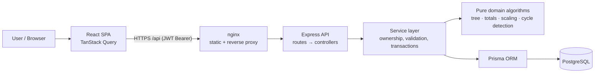

Requests flow `routes → controllers (parse/validate with Zod) → services (business rules,
authorization, transactions) → Prisma → PostgreSQL`. The recursive algorithms live in
`backend/src/domain/` as **pure functions** over an in-memory graph, so they are unit-tested
without a database. Full details, diagrams and trade-offs: **[ARCHITECTURE.md](ARCHITECTURE.md)**.

## Database Design

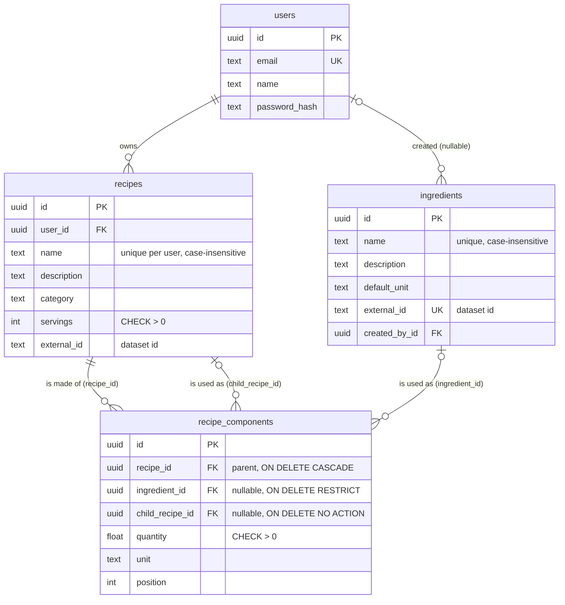

- **`recipe_components` is the polymorphic join table.** It has two nullable foreign keys,
  `ingredient_id` and `child_recipe_id`, and a CHECK constraint
  `num_nonnulls(ingredient_id, child_recipe_id) = 1` guarantees **exactly one** is set. This keeps
  full referential integrity (real FKs to both tables), unlike a `target_type + target_id` design.
- Further CHECK constraints: `quantity > 0`, `servings > 0`, `position >= 0`, no direct
  self-reference (`child_recipe_id <> recipe_id`), recipe lines use unit `batch` or `serving`,
  non-blank names. Unique indexes: `lower(name)` per user for recipes, `lower(name)` for ingredients.
- **Indexes**: `(recipe_id, position)` for ordered component loading, `child_recipe_id` (reverse
  lookups: "used in", delete protection, cycle checks), `ingredient_id`, `(user_id, updated_at)`
  for the dashboard.
- **Ingredients are a shared catalogue** (like the provided dataset), so a "Tomatoes" row is reused
  by every recipe. Only the creator can edit/delete an ingredient (and cannot rename it while other
  users' recipes use it); dataset ingredients are read-only.
- **Deletion behaviour**:
  - Deleting a recipe that **another recipe uses → rejected (409)**, listing the parents. (The FK
    on `child_recipe_id` is `NO ACTION`, so the database enforces this too.)
  - Deleting a recipe cascades to **its own** component lines only — never to sub-recipes.
  - Deleting an ingredient that is used → rejected (409). (`ON DELETE RESTRICT`.)
  - Deleting a user cascades to all their recipes.
- Schema: [`backend/prisma/schema.prisma`](backend/prisma/schema.prisma); migration with the
  hand-written constraints: [`backend/prisma/migrations/20261008000000_init/migration.sql`](backend/prisma/migrations/20261008000000_init/migration.sql).

## Recursive Recipe Model

A recipe yields `servings` servings per **batch**, and all of its component quantities are "per one
batch". The recipe graph is a **DAG** (a recipe can be reused in many places, but never contains
itself, directly or indirectly).

**Scaling rules** (`backend/src/domain/scaling.ts`) — a *scale factor* is the number of batches
needed:

| Situation | Scale factor |
|---|---|
| Root recipe viewed for `S` servings | `S / recipe.servings` |
| Ingredient line `q unit` | required = `q × factor` |
| Sub-recipe line `q batch` | `childFactor = factor × q` |
| Sub-recipe line `q serving` | `childFactor = factor × q / child.servings` |

Examples (both covered by tests): Recipe A uses **2 × Recipe B** (100 g Flour) → **200 g Flour**.
Tomato Sauce (4 servings, 500 g Tomatoes) used as **8 servings** → 2 batches → **1000 g Tomatoes**.

**Loading** (`backend/src/services/recipeGraph.service.ts`): every recipe reachable from the root
is loaded with **two queries regardless of depth** — a recursive CTE collects the reachable ids
(`UNION` de-duplicates, so it terminates even on bad data), then one `findMany` loads those recipes
with their components. No N+1, and each shared sub-recipe is loaded once.

**Tree** (`backend/src/domain/recipeTree.ts`): a recursive function builds the scaled tree served
by `GET /api/recipes/:id/tree`. It tracks the **current recursion path** (not a global visited set,
because a shared sub-recipe legitimately appears in several branches); re-entering a recipe on the
path marks the node `circular: true` instead of recursing forever. Depth (100) and node-count
(10 000) limits protect the server.

**Frontend** (`frontend/src/features/recipes/RecipeTree.tsx`): a single `TreeBranch` component
renders a recipe node and, when expanded, renders itself for every nested recipe — no
`level1/level2/...` code anywhere.

## Circular Dependency Handling

Adding the edge **parent → child** creates a cycle iff `child == parent` or the parent is already
reachable from the child. Before any write that adds recipe components (create, full update, add
component), the service:

1. takes a per-user PostgreSQL **advisory transaction lock**, so two concurrent requests
   (A→B and B→A) cannot both pass the check;
2. loads the user's dependency edges in one query;
3. runs an **iterative DFS with a visited set** from the child looking for the parent
   (`detectCycleOnAdd` in `backend/src/domain/cycleDetection.ts`) — O(V+E), any depth, no
   recursion-depth limit;
4. rejects with **409** and the offending path:
   `"Adding this recipe would create a circular dependency: R2 → R0 → R1 → R2"`.

Defence in depth: a CHECK constraint forbids direct self-reference; tree building and total
expansion detect cycles on the current path and never loop; dataset import runs a three-colour DFS
(`findAnyCycle`) over the whole graph before writing anything. Tests cover A→A, A→B→A, A→B→C→A,
a 25-level chain over the API, 500-level chains in unit tests, diamonds (which are *not* cycles) and
the concurrent case.

## Ingredient Expansion

`GET /api/recipes/:id/ingredients?servings=N` returns the consolidated raw-ingredient list
(`backend/src/domain/ingredientTotals.ts`):

- **Memoised post-order DFS**: the per-batch totals of every recipe are computed **once** and then
  reused, scaled, wherever that recipe appears. Expanding a DAG naïvely as a tree can be
  exponential; this is O(V+E) (a unit test expands a 40-level DAG whose tree has 2⁴⁰ paths).
- Quantities are converted to a base unit per dimension (mass → g, volume → ml) and summed per
  ingredient; non-convertible units (piece, clove, pinch…) stay separate lines.
- The current-path set raises an error on a cycle instead of looping.

The same engine powers the **shopping list** (several recipes, each with its own servings).

## Authentication

- `POST /api/auth/register` hashes the password with **bcrypt** (cost 12 by default) and returns a
  JWT; `POST /api/auth/login` verifies it (same 401 message for unknown email and wrong password).
- JWTs are **HS256**, signed with `JWT_SECRET` (env var, min. 32 chars, validated at start-up),
  expire after `JWT_EXPIRES_IN`, and carry only the user id (`sub`) and email.
- The `authenticate` middleware requires `Authorization: Bearer <token>`, verifies signature,
  algorithm and expiry, and checks the user still exists.
- **Authorization**: every recipe query is scoped to the owner. Accessing someone else's recipe
  returns **403**, a missing one **404**. Users can only use their *own* recipes as sub-recipes.
- Credential endpoints are rate-limited (50 requests / 15 min / IP).

## API Documentation

Base URL: `/api` (`http://localhost:8080/api` with Docker, `http://localhost:4000/api` when running the backend directly). All bodies are JSON.
All endpoints except `/health` and `/auth/register|login` require `Authorization: Bearer <token>`.

**Response envelope**

```jsonc
// success
{ "success": true, "data": { ... }, "meta": { "count": 3 } }   // meta only on lists
// error
{ "success": false, "message": "Human readable message", "errors": [ { "path": "servings", "message": "Servings must be at least 1" } ] }
```

| Status | Meaning |
|---|---|
| 400 | Validation failed, malformed JSON, invalid id, reference to a non-existent ingredient/recipe |
| 401 | Missing / invalid / expired token, wrong credentials |
| 403 | Resource belongs to another user |
| 404 | Resource or route not found |
| 409 | Circular dependency, duplicate name, deleting a recipe/ingredient that is still used |
| 422 | Nesting would exceed 100 levels (rejected on write), or the expanded tree exceeds 10 000 nodes |
| 429 | Too many login/register attempts |
| 503 | Transaction timed out under heavy contention — retry |
| 500 | Unexpected error (generic message; stack traces are never returned in production) |

### Authentication

| Method | Path | Description |
|---|---|---|
| POST | `/auth/register` | Create an account → `201 { user, token }` |
| POST | `/auth/login` | Sign in → `200 { user, token }` |
| GET | `/auth/me` | Current user |

```http
POST /api/auth/register
{ "name": "Alice", "email": "alice@example.com", "password": "secret123" }
```
```json
{ "success": true, "data": {
  "user": { "id": "5b0c…", "email": "alice@example.com", "name": "Alice", "createdAt": "2026-10-08T04:00:00.000Z" },
  "token": "eyJhbGciOiJIUzI1NiIs…" } }
```
Errors: `400` invalid email / password shorter than 8, `409` email already registered, `401` bad credentials (login).

### Recipes

| Method | Path | Description |
|---|---|---|
| GET | `/recipes?search=&category=&sort=updated\|created\|name` | List own recipes. `search` matches name, description, category **and names of directly used ingredients / sub-recipes** |
| GET | `/recipes/categories` | Distinct categories of own recipes |
| POST | `/recipes` | Create a recipe (optionally with components) → `201` |
| GET | `/recipes/:id` | Recipe with ordered components and direct parents (`usedIn`) |
| PUT | `/recipes/:id` | Update fields; if `components` is present it **replaces/syncs** the list |
| DELETE | `/recipes/:id` | Delete (409 if used by another recipe) |
| GET | `/recipes/:id/tree?servings=N` | Fully expanded, scaled recursive tree |
| GET | `/recipes/:id/ingredients?servings=N` | Total (flattened, aggregated) ingredients |
| GET | `/recipes/:id/usages` | Recipes using this one: `direct` and `transitive` |
| POST | `/recipes/:id/duplicate` | Copy a recipe (optional body `{ "name": "…" }`) → `201` |

**Create** — `POST /api/recipes`

```json
{
  "name": "Pizza",
  "description": "Classic margherita",
  "category": "Italian",
  "servings": 4,
  "components": [
    { "type": "recipe", "recipeId": "9f1c…", "quantity": 1, "unit": "batch" },
    { "type": "recipe", "recipeId": "2a7d…", "quantity": 8, "unit": "serving" },
    { "type": "ingredient", "ingredientId": "c3e0…", "quantity": 150, "unit": "g" }
  ]
}
```

- `name`: 1–120 chars, unique per user (case-insensitive). `servings`: integer 1–1000.
- Ingredient component: `ingredientId`, `quantity > 0`, `unit` ∈ `mg g kg ml l tsp tbsp cup piece clove slice pinch bunch` (also `GET /units`).
- Recipe component: `recipeId` (must be your own recipe), `quantity > 0`, `unit` ∈ `batch` (default) | `serving`.

Response `201`:

```jsonc
{ "success": true, "data": {
  "id": "e41b…", "name": "Pizza", "description": "Classic margherita", "category": "Italian",
  "servings": 4, "componentCount": 3, "usedInCount": 0,
  "createdAt": "2026-10-08T04:10:00.000Z", "updatedAt": "2026-10-08T04:10:00.000Z",
  "components": [
    { "id": "71aa…", "type": "recipe", "position": 0, "quantity": 1, "unit": "batch",
      "ingredient": null, "recipe": { "id": "9f1c…", "name": "Pizza Dough", "servings": 2 } },
    // … position 1 (the "serving" line) omitted for brevity
    { "id": "71ab…", "type": "ingredient", "position": 2, "quantity": 150, "unit": "g",
      "ingredient": { "id": "c3e0…", "name": "Mozzarella" }, "recipe": null }
  ],
  "usedIn": [] } }
```

**Update** — `PUT /api/recipes/:id` accepts any subset of `name`, `description`, `category`,
`servings`, `components`. A component carrying an existing `"id"` is updated in place; components
without `id` are created; existing components omitted from the list are deleted; order = array order.

**Tree** — `GET /api/recipes/:id/tree?servings=8` (abridged):

```json
{ "success": true, "data": {
  "type": "recipe", "key": "root", "recipeId": "…", "name": "Lasagna", "servings": 4,
  "quantity": null, "unit": null, "scaleFactor": 2, "yieldServings": 8, "depth": 0, "circular": false,
  "children": [
    { "type": "ingredient", "key": "root/c1", "name": "Pasta Sheets", "quantity": 600, "baseQuantity": 300, "unit": "g" },
    { "type": "recipe", "key": "root/c2", "name": "Bolognese Sauce", "quantity": 1, "unit": "batch",
      "scaleFactor": 2, "depth": 1, "children": [ { "type": "recipe", "name": "Tomato Sauce", "children": [ … ] } ] }
  ] } }
```

**Total ingredients** — `GET /api/recipes/:id/ingredients?servings=8`:

```json
{ "success": true, "data": {
  "recipeId": "…", "name": "Pizza", "baseServings": 4, "servings": 8,
  "ingredients": [
    { "ingredientId": "…", "name": "Flour", "quantity": 600, "unit": "g" },
    { "ingredientId": "…", "name": "Water", "quantity": 400, "unit": "ml" } ] } }
```

**Errors**

```json
// 409 — POST /api/recipes/{B}/components { "type": "recipe", "recipeId": "{A}" } when A uses B
{ "success": false, "message": "Adding this recipe would create a circular dependency: B → A → B",
  "errors": { "cycle": ["<B id>", "<A id>", "<B id>"] } }

// 409 — DELETE /api/recipes/{tomatoSauce}
{ "success": false, "message": "This recipe cannot be deleted because it is used by: Pizza Sauce, Bolognese Sauce. Remove it from those recipes first.",
  "errors": { "usedBy": [ { "id": "…", "name": "Pizza Sauce" }, { "id": "…", "name": "Bolognese Sauce" } ] } }

// 400 — POST /api/recipes { "name": "", "servings": 0 }
{ "success": false, "message": "Validation failed: name: Name is required",
  "errors": [ { "path": "name", "message": "Name is required" }, { "path": "servings", "message": "Servings must be at least 1" } ] }

// 403 — another user's recipe
{ "success": false, "message": "You do not have access to this recipe" }
```

### Recipe components

| Method | Path | Body | Description |
|---|---|---|---|
| POST | `/recipes/:id/components` | `{ "type": "ingredient", "ingredientId", "quantity", "unit" }` or `{ "type": "recipe", "recipeId", "quantity", "unit"? }` | Append a component → `201` component (cycle-checked) |
| PUT | `/recipes/:id/components/:componentId` | `{ "quantity"?, "unit"?, "position"? }` | Update quantity/unit or move to a position |
| DELETE | `/recipes/:id/components/:componentId` | – | Remove the component (the referenced recipe/ingredient is untouched) |
| PUT | `/recipes/:id/components/order` | `{ "componentIds": [ … ] }` | Reorder (must be a permutation of all component ids) |

Errors: `400` invalid body / unit not valid for the line type / unknown target, `403` not your
recipe, `404` component not in this recipe, `409` circular dependency.

### Ingredients, units, shopping list

| Method | Path | Description |
|---|---|---|
| GET | `/ingredients?search=` | Shared catalogue with `usageCount` and `editable` |
| POST | `/ingredients` | `{ "name", "description"?, "defaultUnit"? }` → `201` (409 duplicate name) |
| GET | `/ingredients/:id` | One ingredient |
| PUT | `/ingredients/:id` | Update (creator only → else 403) |
| DELETE | `/ingredients/:id` | Delete (creator only; 409 if used) |
| GET | `/units` | `{ ingredientUnits: [{code,label,dimension}], recipeUnits: ["batch","serving"] }` |
| POST | `/shopping-list` | `{ "items": [ { "recipeId", "servings"? } ] }` → combined totals |
| GET | `/health` | Public liveness + DB check |

## Project Structure

```
recipe-management-system/
├── backend/
│   ├── prisma/
│   │   ├── schema.prisma            # data model
│   │   ├── migrations/              # SQL migration incl. CHECK constraints
│   │   ├── data/                    # provided dataset (ingredients.json, recipes.json)
│   │   └── seed.ts                  # demo user + dataset import
│   ├── src/
│   │   ├── domain/                  # PURE recursive algorithms (tree, totals, scaling, cycles, units)
│   │   ├── services/                # business logic, ownership, transactions, graph loading
│   │   ├── controllers/             # HTTP ↔ service, Zod parsing
│   │   ├── routes/                  # Express routers
│   │   ├── validators/              # Zod schemas
│   │   ├── middleware/              # authenticate, errorHandler
│   │   ├── config/ lib/ utils/ types/ scripts/
│   │   ├── app.ts                   # Express app (helmet, cors, json limit, logging)
│   │   └── server.ts
│   ├── tests/unit/                  # domain algorithm tests (no DB)
│   ├── tests/integration/           # API tests with Supertest on PostgreSQL
│   ├── Dockerfile, docker-entrypoint.sh
│   └── package.json
├── frontend/
│   ├── src/
│   │   ├── api/                     # typed fetch client + endpoints + types
│   │   ├── auth/                    # AuthContext, protected routes, token storage
│   │   ├── components/ui|layout/    # Button, Card, Badge, Field, ConfirmDialog, states…
│   │   ├── features/recipes/        # RecipeTree (recursive), RecipeForm, TotalIngredients, queries
│   │   ├── pages/                   # Recipes, Detail, Create/Edit, Ingredients, Shopping list, Auth
│   │   └── lib/                     # formatting, helpers
│   ├── Dockerfile, nginx.conf
│   └── package.json
├── docs/screenshots/
├── .github/workflows/ci.yml
├── docker-compose.yml
├── .env.example
├── README.md · ARCHITECTURE.md · FINAL_CHECKLIST.md · LICENSE
```

## Prerequisites

- **Docker route**: Docker Engine 24+ with Docker Compose v2.
- **Manual route**: Node.js **20.12+** (22 recommended) and npm 10+, PostgreSQL 14+ (16 recommended).

## Local Setup

```bash
unzip recipe-management-system-submission.zip && cd recipe-management-system
cp .env.example .env        # then edit JWT_SECRET and POSTGRES_PASSWORD
```

Then either [run with Docker](#running-with-docker) or [without Docker](#running-without-docker).

## Environment Variables

| Variable | Used by | Required | Default | Description |
|---|---|---|---|---|
| `POSTGRES_USER` | compose | – | `recipes` | DB user created in the postgres container |
| `POSTGRES_PASSWORD` | compose | **yes** | – | DB password (URL-safe characters) |
| `POSTGRES_DB` | compose | – | `recipes` | Database name |
| `POSTGRES_PORT` | compose | – | `5432` | Host port for PostgreSQL |
| `DATABASE_URL` | backend | **yes** (manual) | built by compose | Prisma connection string |
| `TEST_DATABASE_URL` | backend tests | for integration tests | `…/recipes_test` | Separate DB for tests (name must contain `test`; tables are truncated) |
| `JWT_SECRET` | backend | **yes** | – | HMAC secret, ≥ 32 characters (`openssl rand -base64 48`) |
| `JWT_EXPIRES_IN` | backend | – | `1d` | Token lifetime (`15m`, `12h`, `7d`…) |
| `PORT` | backend | – | `4000` | API port |
| `FRONTEND_URL` | backend | – | `http://localhost:5173` | Allowed CORS origin(s), comma separated |
| `BCRYPT_SALT_ROUNDS` | backend | – | `12` | bcrypt cost |
| `NODE_ENV` | backend | – | `development` | `production` hides error details |
| `RUN_SEED` | backend container | – | `true` | Run the seed at container start (imports the dataset only if not imported yet) |
| `SEED_FORCE` | seed | – | `false` | Re-import the dataset even if already imported (overwrites the demo user's dataset recipes) |
| `SEED_DEMO_EMAIL` / `SEED_DEMO_PASSWORD` | seed | – | `demo@recipes.local` / `Demo@12345` | Demo account (public, not a secret) |
| `FRONTEND_PORT` | compose | – | `8080` | Published host port of the app (the API is at `/api` on the same port) |
| `VITE_API_URL` | frontend build | – | `/api` | API base URL if the API is on another origin |

The backend validates its environment at start-up and refuses to start with a missing or short
`JWT_SECRET`. No secrets are committed; `.env` is git-ignored.

## Running with Docker

```bash
cp .env.example .env            # set JWT_SECRET and POSTGRES_PASSWORD
docker compose up --build
```

| Service | URL |
|---|---|
| Frontend (nginx) | http://localhost:8080 |
| API | http://localhost:8080/api (through nginx; the backend port is deliberately not published so clients cannot spoof `X-Forwarded-For` to bypass the login rate limit) |
| PostgreSQL | localhost:5432 |

Start-up order is enforced with health checks: `postgres` (pg_isready) → `backend` (applies
migrations, seeds when `RUN_SEED=true`, `/api/health`) → `frontend`. Sign in with
**demo@recipes.local / Demo@12345**. Stop with `docker compose down` (add `-v` to drop the data).

## Running Without Docker

```bash
# 1. PostgreSQL: create a database (or start only the DB container: docker compose up -d postgres)
# 2. Backend
cd backend
cp ../.env.example .env          # set DATABASE_URL, JWT_SECRET, FRONTEND_URL=http://localhost:5173
npm install
npm run db:migrate               # prisma migrate deploy
npm run db:seed                  # demo user + provided dataset
npm run dev                      # http://localhost:4000

# 3. Frontend (new terminal)
cd frontend
npm install
npm run dev                      # http://localhost:5173 (proxies /api to localhost:4000)
```

Production build: `npm run build && npm start` (backend) and `npm run build` (frontend → `dist/`).

## Database Migration

- Apply migrations: `npm run db:migrate` (`prisma migrate deploy`; creates the DB if missing).
- Create a new migration after editing the schema (development): `npm run db:migrate:dev -- --name <name>`.
- Reset (drops all data, re-applies, re-seeds): `npm run db:reset`.
- The Docker backend runs `prisma migrate deploy` automatically on every start.

## Seed Data

`npm run db:seed` (and the Docker start-up) runs `backend/prisma/seed.ts`. It is safe to run on every
start: the dataset is imported only when the demo user has no imported recipes yet, so your edits
survive restarts (`SEED_FORCE=true` re-imports; the import itself is an idempotent upsert):

1. creates/updates the demo user `demo@recipes.local` / `Demo@12345`;
2. imports the **dataset provided with the task** from `backend/prisma/data/`
   (downloaded from the dataset link in the task PDF): **71 ingredients, 55 recipes,
   189 components**, categories such as Sauces, Pasta, Indian, Desserts, Meal.

The importer (`backend/src/scripts/importDataset.ts`) validates the files with Zod, checks that
every `ingredient_id` / `recipe_id` reference resolves, that units are supported and that the graph
is acyclic **before** writing; it preserves the dataset's `id` (as `externalId`, used for upserts),
`name`, `category`, `servings`, `description`, component order, quantities and units. The dataset is
interesting recursively: e.g. *Grand Feast → Family Pasta Feast → Lasagna → Lasagna Sauce →
Bolognese Sauce → Tomato Sauce* (6 levels), with Tomato Sauce reused by both Bolognese Sauce and
Pizza Sauce. Point `DATASET_DIR` at another folder with the same two files to import
a different dataset.

## Testing

```bash
cd backend
npm run test:unit          # domain algorithms, no database needed
npm test                   # unit + integration (needs PostgreSQL at TEST_DATABASE_URL)
#   e.g. docker compose up -d postgres  (the test DB is created automatically by the test setup)

cd frontend
npm test                   # React Testing Library (jsdom)
```

| Suite | Tests | Covers |
|---|---|---|
| backend unit | 52 | cycle detection (A→A, A→B→A, A→B→C→A, 500-level chain, diamonds, corrupted graphs, 20 000-node DAG), scaling & unit conversion, recursive tree (Lasagna, 60-level nesting, positions, circular marker, depth limit), totals (2 × B = 200 g, Pizza example, 8-of-4 servings = 1000 g, A→B→C→D→E, aggregation, 2⁴⁰-path DAG memoisation), dataset validation & expansion, nesting-depth computation |
| backend integration | 82 | auth (hashing, duplicate email, invalid/expired/forged tokens), recipe CRUD & sync, validation (names, servings, quantities, units, ids, references), authorization (403 on every endpoint, foreign sub-recipes), component CRUD/reorder, cycle prevention via API incl. concurrency, max nesting depth on write (422), cross-user ingredient rename blocked, deletion of referenced recipes/ingredients, expansion & scaling via API, no-N+1 query count, duplication, shopping list, idempotent dataset import |
| frontend | 20 | recursive tree (default expansion, toggles, keyboard, badges, quantities, links, 25-level Expand/Collapse all, circular marker), form draft validation/serialisation, servings input, formatting |

Latest local run: **154 / 154 passing** (see [FINAL_CHECKLIST.md](FINAL_CHECKLIST.md)).

## Deployment

> **Status: tested locally only — not deployed.** No public URL is claimed.

A realistic, low-cost deployment:

1. **Database** — managed PostgreSQL (Neon, Supabase, Render PostgreSQL or AWS RDS). Copy its
   connection string (with `sslmode=require`).
2. **Backend** — Render / Railway / Fly.io from `backend/Dockerfile`. Environment:
   `DATABASE_URL`, `JWT_SECRET` (generated), `FRONTEND_URL=https://<your-frontend-domain>`,
   `NODE_ENV=production`, `RUN_SEED=true` for the first deploy (then `false`). The container runs
   migrations on start; health check path `/api/health`.
3. **Frontend** — Vercel / Netlify: root `frontend`, build `npm run build`, output `dist`,
   env `VITE_API_URL=https://<your-api-domain>/api`, and an SPA rewrite of all paths to
   `/index.html`.
   *Alternative:* deploy the whole `docker-compose.yml` to a single VM (e.g. a small EC2/Droplet)
   behind a TLS-terminating proxy (Caddy) — nginx in the frontend image already proxies `/api`.
4. Use HTTPS everywhere, rotate `JWT_SECRET` to invalidate all sessions, and back up the DB.

## Assumptions

- **Dataset semantics**: a dataset recipe component `{ "type": "recipe", "recipe_id", "quantity": 1 }`
  has no unit; it is interpreted as **quantity × batches** of the referenced recipe (unit `batch`).
  The UI additionally supports `serving` (e.g. "8 servings of Tomato Sauce").
- Recipe quantities are stored **per batch** (per `servings` yield) — the dataset's convention.
- Dataset recipes are imported into the **demo user's** account; dataset ingredients become the
  shared, read-only base catalogue.
- Ingredients are **global/shared** (like the dataset's catalogue), while recipes are private.
  Users may add ingredients; only the creator can edit/delete them, and an ingredient used in other
  users' recipes cannot be renamed (that would silently change their recipes).
- Recipe names are unique per user (case-insensitive) to avoid ambiguous sub-recipe pickers.
- A user can only reuse **their own** recipes (sharing/public recipes are out of scope).
- Accessing another user's recipe returns **403** (not 404) to make authorization explicit; ids
  are random UUIDs, so this does not enable enumeration.
- Quantities are `double precision` and rounded to 3 decimals for presentation.
- Unit conversion is limited to mass (mg/g/kg) and volume (ml/l/tsp/tbsp/cup); count-like units
  are not converted, and mass↔volume conversion (density) is out of scope.

## Design Decisions

- **Two nullable FKs + CHECK** for the polymorphic component instead of `type/target_id`: real
  foreign keys on both sides, DB-enforced "exactly one", simple joins.
- **Pure domain layer** for recursion (tree, totals, scaling, cycles) → exhaustively unit-tested
  and reused by API, seed validation and shopping list.
- **Server-side recursion**: the frontend gets the whole scaled tree in one request (no per-node
  calls); the backend loads it in two SQL queries using a recursive CTE.
- **Path set vs. visited set**: the tree uses the current path (shared sub-recipes may repeat in
  different branches); cycle detection uses a global visited set; totals use memoisation + path set.
- **Prevent rather than cascade** deletion of referenced recipes/ingredients — silently changing
  other recipes would be surprising; the 409 lists what to fix.
- **Advisory locks** serialise graph mutations per user, closing the concurrent-cycle race without
  serialisable transactions.
- **Express 5** (native async error propagation), Zod for every input, one error envelope.
- **JWT in localStorage + Bearer header**: simple, no CSRF surface; trade-off is XSS exposure,
  mitigated by React escaping, Helmet and no third-party scripts (see ARCHITECTURE.md).
- **nginx reverse proxy** in Docker gives a single origin (no CORS in that setup).

## Bonus Features

| Feature | Where |
|---|---|
| Recipe search (name, description, category) | Dashboard search box, `GET /recipes?search=` |
| **Dependency search** — find recipes that use an ingredient or sub-recipe | same search (e.g. "Tomato Sauce", "Flour") |
| Filter by category, sort by updated/created/name | Dashboard |
| Recipe duplication | "Duplicate" on the detail page, `POST /recipes/:id/duplicate` |
| Shopping-list generation (multiple recipes, individual servings, copy to clipboard, checkboxes) | "Shopping list" page, `POST /shopping-list` |
| Show all recipes using a recipe (direct + transitive) | "Used in" card, `GET /recipes/:id/usages`; editor disables cycle-creating choices |
| Show complete dependency tree | Recursive explorer with Expand all |
| Copy total ingredients | "Copy list" |
| Rate limiting, request logging, health checks, reverse proxy | express-rate-limit, morgan, `/api/health` + Docker health checks, nginx |
| Automated tests + CI | Vitest suites, `.github/workflows/ci.yml` (not executed in this environment) |

## Screenshots

Captured from the running application (headless Chromium) with the seeded dataset:

| | |
|---|---|
| Dashboard 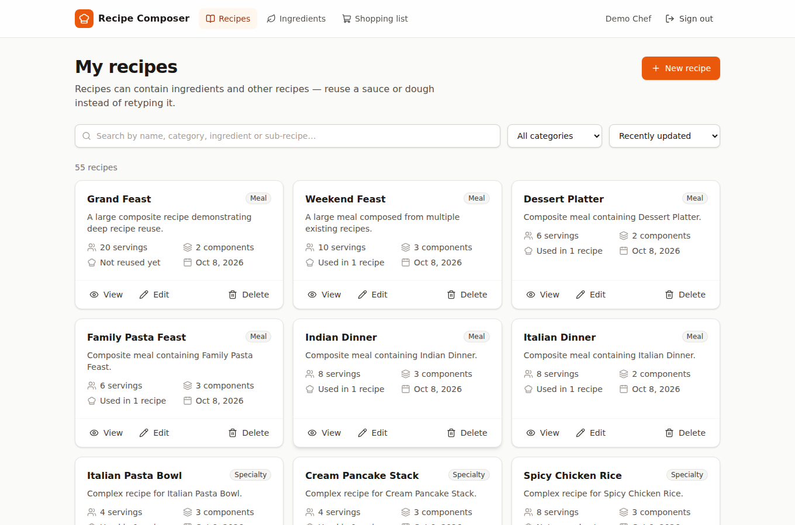 | Recipe detail: recursive tree + totals  |
| Deep nesting (Grand Feast, 6 levels) 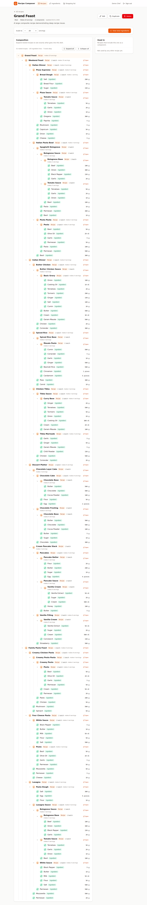 | Create recipe (ingredient + existing recipe) 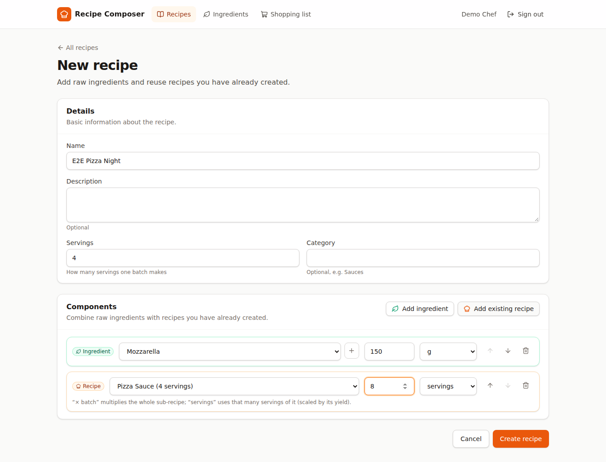 |
| Recipe editor (in the sub-recipe picker, recipes that would create a cycle are disabled) 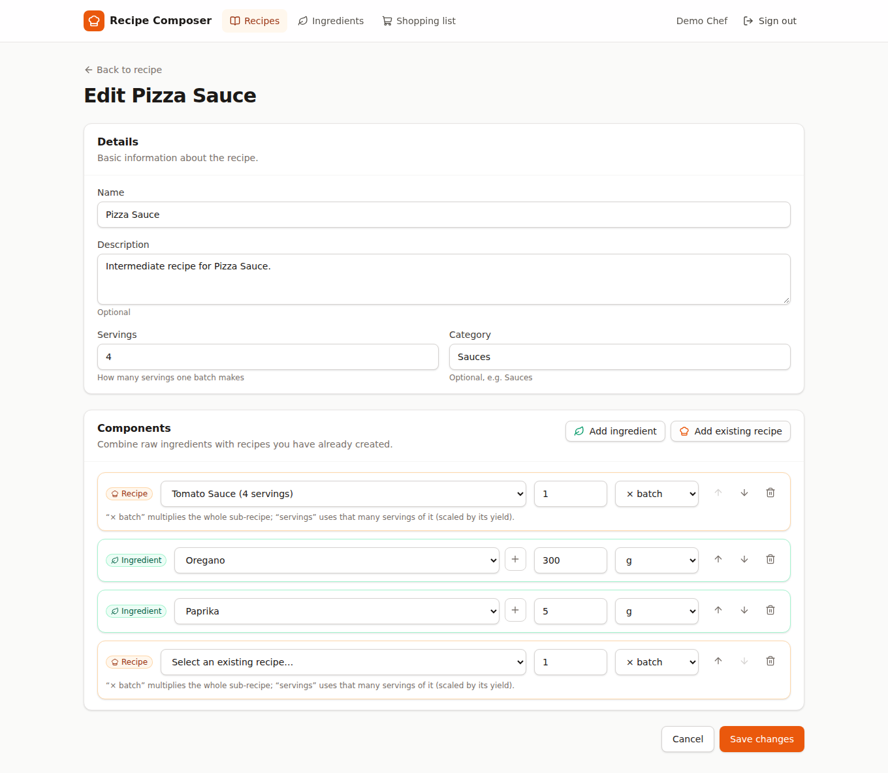 | Deleting a used recipe is blocked 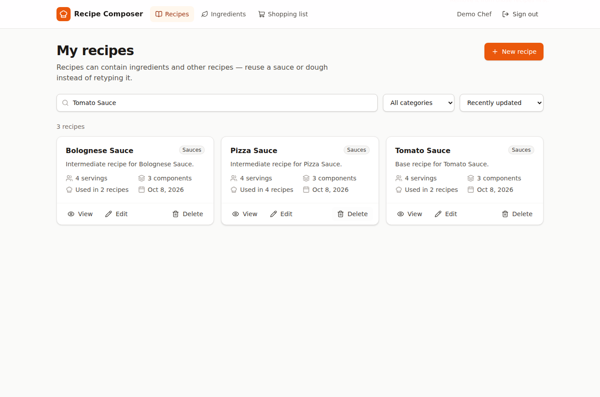 |
| Shopping list 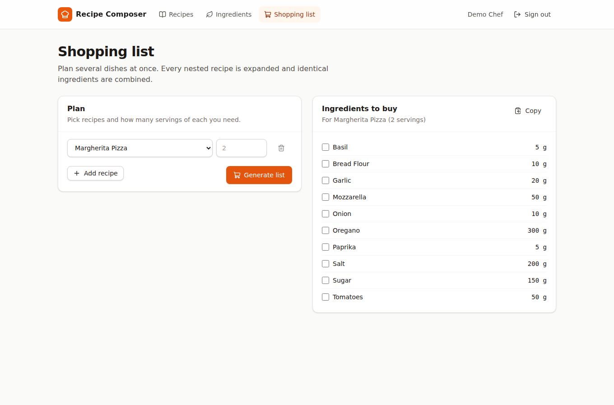 | Ingredients catalogue 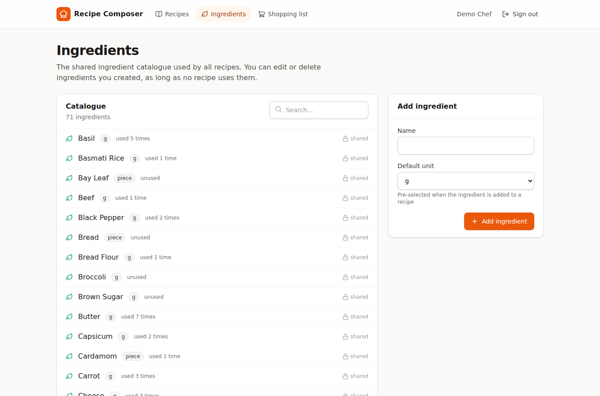 |
| Mobile 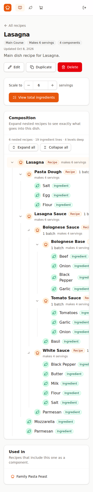 | Login 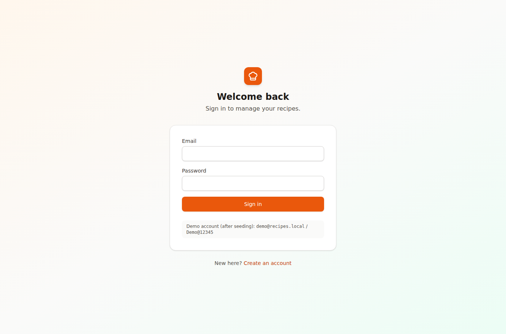 |

## License

MIT — see [LICENSE](LICENSE).
